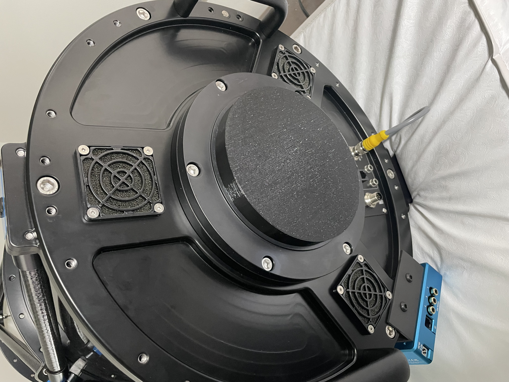

# Plane Wave CDK 14 Dust covers
OpenScad files to 3D print a variety of dust cover fitting a PlaneWave CDK14 with a WR35 focuser.

My CDK 14 has a Moonlite Nitecrawler focuser (the big one, aka WR35), and a Moonlite Sidewinder tilt corrector.

I built a vaiety of dust covers: one for the secondary mirror, a plug for the baffle connected to the primary, and a cover for the Moonlite dove tail.

Then on the focuser side, one external cover for the sidewinder, one plug for the focuser without sidewinder and last an inside plug, that gets inside the focuser, and can be used as a double barrier behind the side winder dust cover.

I carry the focuser + filter wheel + camera in one part, and the scope in another part, and it is essential that the filter do not get contaminated by dust, hence the dual cover system.

I print those in TPU (so they are very flexible and resilient) at 40% infill.
 

